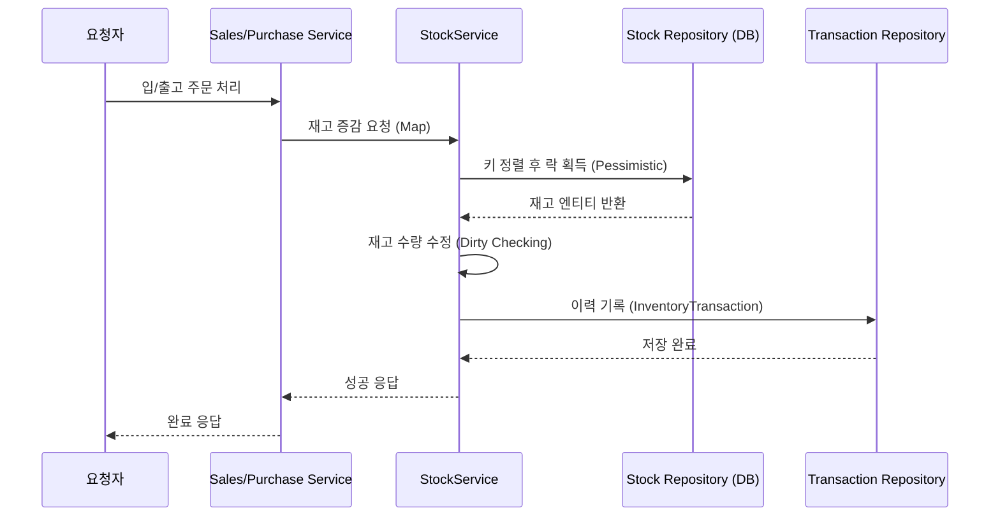
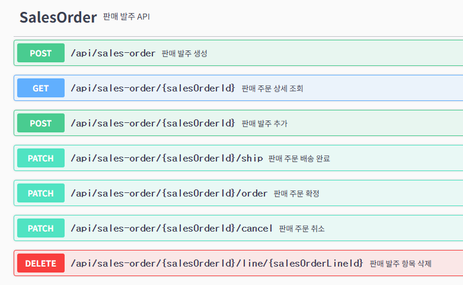
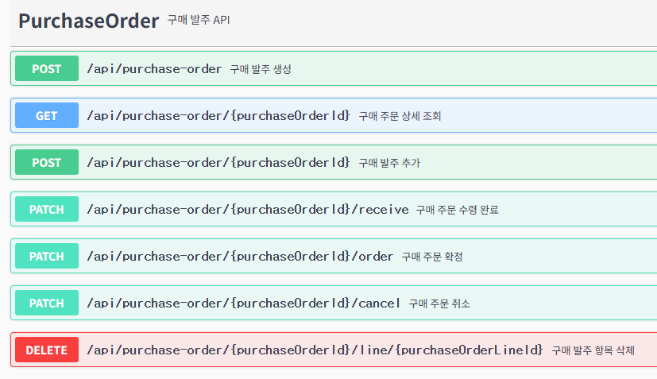
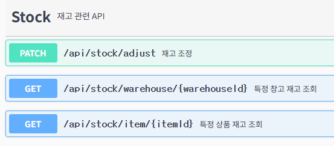
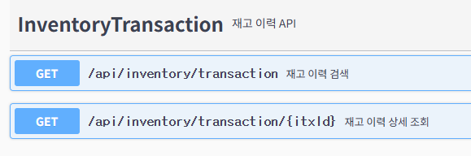

# Inventory & Order Management System
**경량 재고 중심 주문 관리 프로젝트입니다. 현재 백엔드(Spring Boot) 기반으로 도메인, 저장소, 서비스, 컨트롤러 계층과 통합/단위 테스트가 구현되어 있습니다.**

---

## Key Challenges & Solutions

### 1. 동시성 제어 (Concurrency Control)
* **Problem**: 여러 사용자가 동시에 동일 상품을 출고할 때, 재고 수량이 음수가 되거나 데이터가 꼬이는 무결성 저해 이슈 발생.
* **Solution**: **비관적 락(`PESSIMISTIC_WRITE`)**을 도입하여 트랜잭션 도중 다른 트랜잭션이 해당 로우를 수정하지 못하도록 강제했습니다.
* **Verification**: `CountDownLatch`를 활용한 멀티 스레드 통합 테스트를 통해 8개의 요청이 동시에 들어와도 데이터가 정확히 차감되는지 증명했습니다.

### 2. 재고 트랜잭션 기록 (Inventory Transaction)
* **Problem**: 단순 수량 변경만으로는 입출고 이력을 추적하기 어려움.
* **Solution**: 재고 변화가 일어날 때마다 `inventory_transactions` 테이블에 변경 이력(Delta)과 유형(Type)을 기록하여 데이터의 변경 경로를 보존했습니다.

### 3. 성능 최적화(캐싱 vs DB 인덱싱)
* **Problem**: 변경이 많지 않은 상품, 창고, 파트너 데이터의 빈번한 조회로 인한 서버 우려 및 캐싱 도입 고려.
* **Analysis**: 검색 조건(동적 쿼리)와 페이징 처리가 결합되어 캐싱 키(Key)의 조합이 기하급수적으로 증가함.
* **Solution**: DB 인덱스 최적화를 통해 쿼리 실행 속도를 확보하는 것이 무분별한 캐싱 도입보다 낫다 생각하여 도입하지 않고 인덱싱에 집중하였습니다.
* **Verification**: EXPLAIN 분석을 통해 `type: ref, range, index_merge` 및 `key` 최적화를 확인하였으며, `Full Table Scan`을 방지하여 응답 성능을 확보했습니다.

### 4. 동시성 및 데이터 안정성을 위한 핵심 설계
* **데드락 방지**: 재고 변경 요청 시 대상 리소스(Item, Warehouse)를 정렬하여 락을 획득함으로써, 멀티 스레드 환경에서 발생할 수 있는 데드락 상황을 물리적으로 차단함.
* **재시도 전략**: `@Retryable`을 활용해 일시적인 락 획득 실패나 데드락 발생 시 자동으로 재시도하여 시스템의 복원력을 확보함.
* **불필요한 리소스 조회 최적화**: `getReferenceById`를 활용하여 불필요한 `SELECT` 쿼리 없이 FK 관계를 관리하여 DB I/O 부하를 줄임.
* **원자성 보장**: 재고 변경 이력(InventoryTransaction) 저장을 재고(Stock) 서비스 트랜잭션 내부에 포함하여 데이터 변경의 추적성을 보장함.

---

## Tech Stack
* **Language**: Java 17, Spring Boot 3.x
* **Persistence**: Spring Data JPA, QueryDSL, MySQL
* **Infrastructure**: Testcontainers (테스트 환경 격리), Flyway (DB 마이그레이션)
* **Testing**: JUnit 5, Mockito

---

## System Architecture
표준 레이어드 아키텍처를 기반으로 도메인 간 결합도를 낮추고 비즈니스 로직을 서비스 계층에 집중시켰습니다.

---

## API Reference
주요 엔드포인트는 다음과 같습니다. (전체 목록은 Swagger 문서 참조)

### 판매 발주 API

### 구매 발주 API

### 재고 API

### 재고 이력 API

---

## Future Plan
1.  **비동기 처리**: 무거운 집계 로직을 별도 스레드/배치로 분리
2.  **UI 완성**: AI 도구를 활용하여 API 기반의 프론트엔드 프로토타입을 빠르게 구축하고, 핵심 로직 중심의 화면으로 테스트 구축